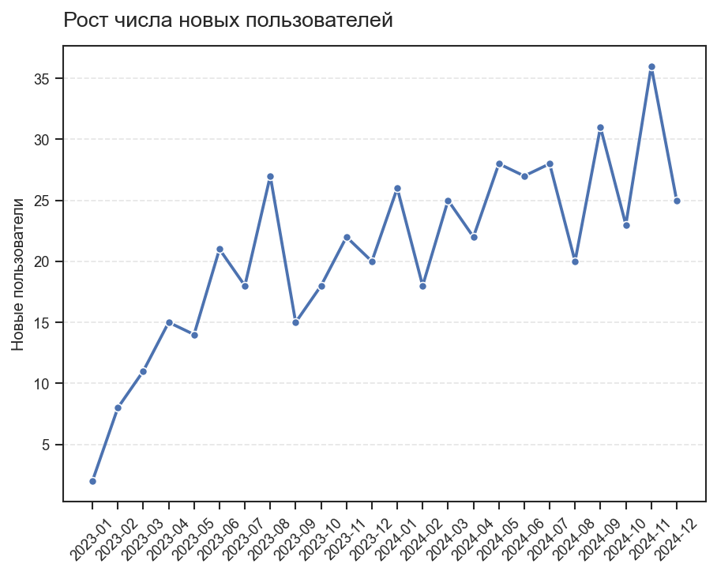
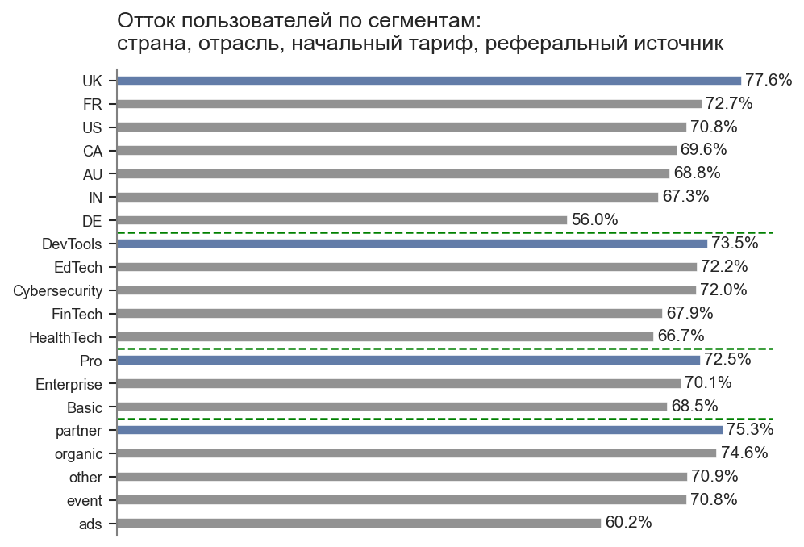
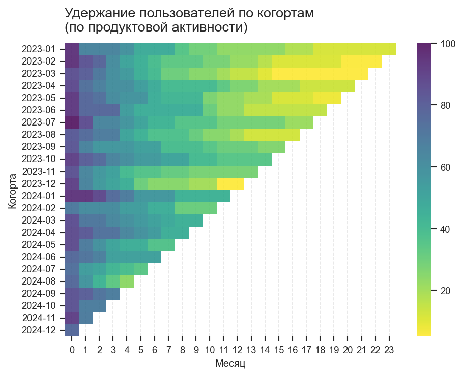
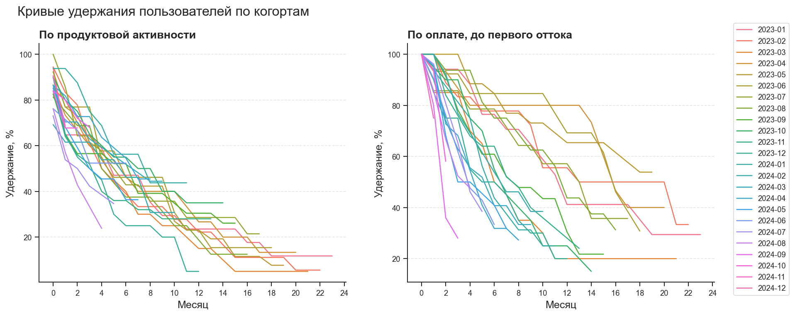

# Анализ международного SaaS-продукта: рост, отток и удержание пользователей

## О проекте
В рамках проекта на SQL и Python проведен анализ роста продукта, вовлеченности, активации, оттока и удержания пользователей, а также связи продуктовой активности с удержанием для условного SaaS-бизнеса.

Источник данных: [Kaggle](https://www.kaggle.com/datasets/rivalytics/saas-subscription-and-churn-analytics-dataset), River@Rivalytics. 

Анализ показал расхождение между оплатой и фактическим использованием продукта, снижение удержания пользователей после первого месяца использования продукта, значительный уровень оттока (агрегированный показатель), а также отсутствие явной зависимости между уровнем продуктовой активности и удержанием пользователей в рамках данного датасета.

Это указывает на необходимость повышения вовлеченности пользователей, более глубокий анализ пользовательского поведения и пересмотр метрик продуктовой активности.

## Структура
data/ – данные  
python/ – анализ на Python  
sql/ – SQL-запросы  
visuals/ – графики  
global_saas_growth_churn_retention.pdf/ – отчет о проекте  

## Методология 
- Анализ роста продукта (число новых пользователей в месяц, общее число пользователей по месяцам, процентное изменение числа новых пользователей в месяц MoM)
- Анализ пользовательской активности (MAU, воронка активации)
- Анализ общего оттока и оттока по сегментам (churn rate)
- Когортный анализ и удержание пользователей по продуктовой активности и оплате (retention rate)
- Сегментация пользователей по продуктовой активности и анализ связи пользовательской активности с удержанием пользователей.

## Инструменты
- PostgreSQL (агрегаты, подзапросы, JOIN, CTE, CASE, UNION, оконные функции)
- Python (pandas, matplotlib, seaborn)
- DBeaver, JupyterLab

## Анализ
**Рост продукта:**

Число новых пользователей быстрее всего растет в первые месяцы после запуска продукта, затем рост замедляется. Наблюдаются заметные пики и спады, без выраженной сезонности. Процентное изменение числа новых пользователей в месяц MoM – в диапазоне от -44% до 300%.

**Вовлеченность пользователей:**  

Медиана времени, которое проходит с момента регистрации аккаунта до первой подписки, – 16 дней. Медиана времени с момента регистрации аккаунта до первого использования – 5 дней. MAU устойчиво растет до июля 2024 г., затем снижается. Средний MAU составляет 149 пользователей в месяц.

**Сегментация и отток:**  

Общий отток пользователей – 70,4% (агрегированный показатель). Самые высокие показатели оттока по сегментам: страна – Великобритания, отрасль – разработка ПО, начальный тариф – Pro, реферальный источник – партнеры. 

В рамках данного датасета не выявлено явной зависимости между уровнем продуктовой активности и удержанием пользователей.

**Когортный анализ и удержание пользователей:**  

Удержание пользователей по продуктовой активности значительно снижается после первого месяца использования продукта (снижение может достигать 30%). 

Удержание по оплате до первого оттока выше, чем по продуктовой активности. Часть пользователей возвращается после первого оттока. 

**Метрики продукта по странам:**  

Распределение пользователей, отток и жизненный цикл различаются между странами. Продукт представлен в 7 странах, 58% пользователей находится в США. Отток пользователей из США также самый высокий (206 пользователей).

## Ключевые результаты
1.	Удержание пользователей по оплате выше удержания по продуктовой активности, что связано со слабой вовлеченностью пользователей, автопродлением подписок или активным, но редким использованием продукта. Это говорит о расхождениях между оплатой и фактическим получением ценности от продукта.
2.	Резкое снижение удержания пользователей по продуктовой активности после первого месяца использования продукта указывает на недостаточно сформированную ценность в первые недели взаимодействия с продуктом.
3.	Отсутствие явной зависимости между продуктовой активностью и удержанием пользователей связано с ограничениями данных, а также указывает на то, что метрики активности не отражают реальное получение ценности от продукта. 
4.	Значительный общий уровень оттока пользователей говорит о недостаточно сформированной долгосрочной ценности продукта.
5.	Часть пользователей возвращается после первого ухода, что может быть связано с нерегулярным использованием продукта. 
6.	Замедление темпа роста числа новых пользователей говорит о снижении эффективности каналов привлечения пользователей, ограничениях продукта или насыщении рынка.
7.	Между странами наблюдаются различия по оттоку и жизненному циклу пользователей. Наиболее высокий отток характерен для пользователей из США и Великобритании, что может указывать на недостаточное соответствие продукта потребностям этих рынков.

## Рекомендации и следующие шаги
1.	Улучшить онбординг и сократить медианное время от регистрации до первого использования с 5 до 1-2 дней за счет упрощения первого опыта использования продукта и применения триггеров и напоминаний (рассылки по email, уведомления).
2.	Провести дополнительный анализ пользовательского поведения и выявить действия, связанные с получением ценности продукта: определить целевые действия и изменения в способах использования продукта перед оттоком.
3.	Провести исследование пользовательской аудитории для уточнения факторов ценности продукта и проверить гипотезу о необходимости изменения/расширения функционала платных тарифов.
4.	Проверить гипотезу о возможности вернуть недавно ушедших пользователей (например, посредством предложения скидок), оценив влияние таких предложений на реактивацию и удержание.
5.	Оценить эффективность каналов привлечения пользователей (конверсия, удержание) для оптимизации маркетинговой стратегии. 
6.	Провести дополнительный анализ поведения пользователей по странам, включая различия в использовании продукта и оценку вклада каждой страны в выручку, для оптимизации продуктового предложения.
7.	Повысить качество данных для расширения возможностей и повышения надежности продуктовой аналитики: устранить проблемы в последовательности событий (регистрация - подписка - использование) и обеспечить корректность данных по окончанию подписок.

## Ограничения анализа
Основные ограничения связаны с тем, что датасет содержит сгенерированные данные.
- Некорректные временные связи: даты первого использования продукта предшествуют датам регистрации аккаунта.
- Отсутствие пользователей без подписки или активности.
- В большинстве случаев нет данных по окончанию подписок.
- Слабая связь между продуктовой активностью и удержанием пользователей.

**Полный отчет о проекте**: [global_saas_growth_churn_retention.pdf](global_saas_growth_churn_retention.pdf)
